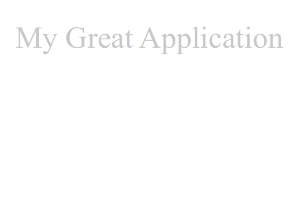
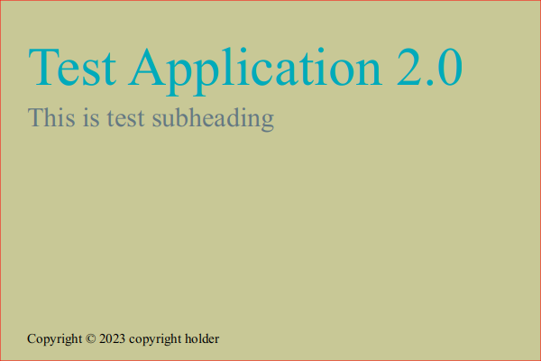

# Generate splash screen

You can generate simple splash screen for your application using a predefined template. Some options can be customized.

To generate splash screen, simply run the following command:

```
docker run  -v ${PWD}:/workspace  ghcr.io/bitshifted/ui-graphics-tools:<version>  splash --config-file my-config.yaml
```

where `<version>` is image version and `my-config.yaml` is the configuration file in YAML format.

The simplest configuration file looks like this:

```yaml
title: My Great Application
```

This will generate a PNG image of size 600x400 in location `output/splash/splash.png`. Simplest splash screen sloos like this:



# Configuration properties

There are some other options you can configure in configuration file. See the example bellow:

```yaml
title: Test Application 2.0 # title of the application
title-color: "#00AABB"  # title color
subheading: This is test subheading # subheading text
subheading-color: rgb(100,120,130) # subheading color
copyright: copyright holder # copyright information
background-fill: rgb(200,200,150) # background color
splash-border-color: "red" # splash screen border color
```

This will yield the following image:



# Command line options

You can use the following comand line options:

```bash
Flags:
      --[no-]help                Show context-sensitive help (also try --help-long and --help-man).
  -v, --[no-]verbose             Verbose mode
      --config-file=CONFIG-FILE  Splash screen configuration file
      --output-dir="output/splash"  
                                 Splash screen output directory
      --output-file="splash.png"  
                                 Splash screen output file

```